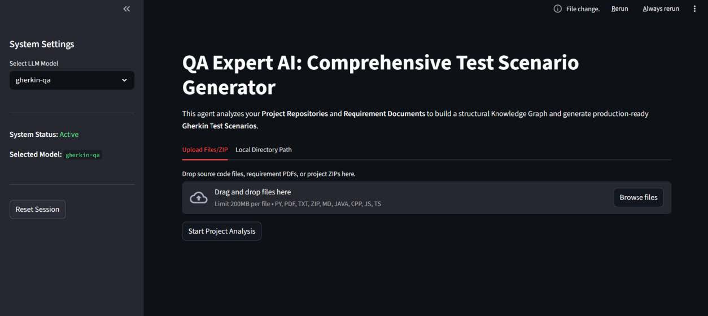
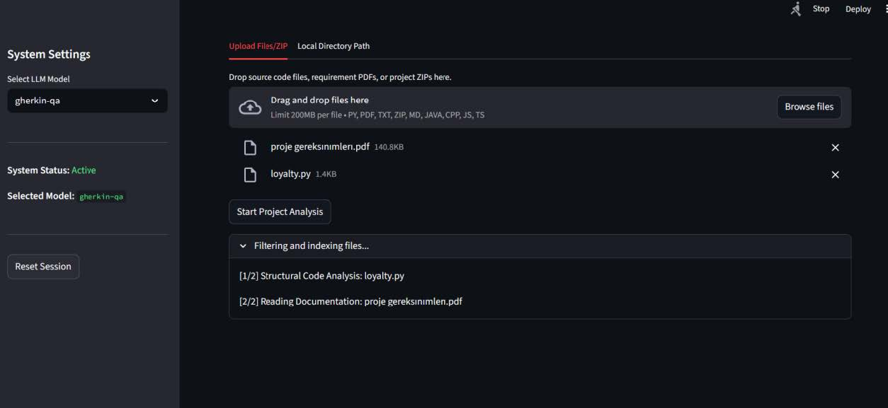
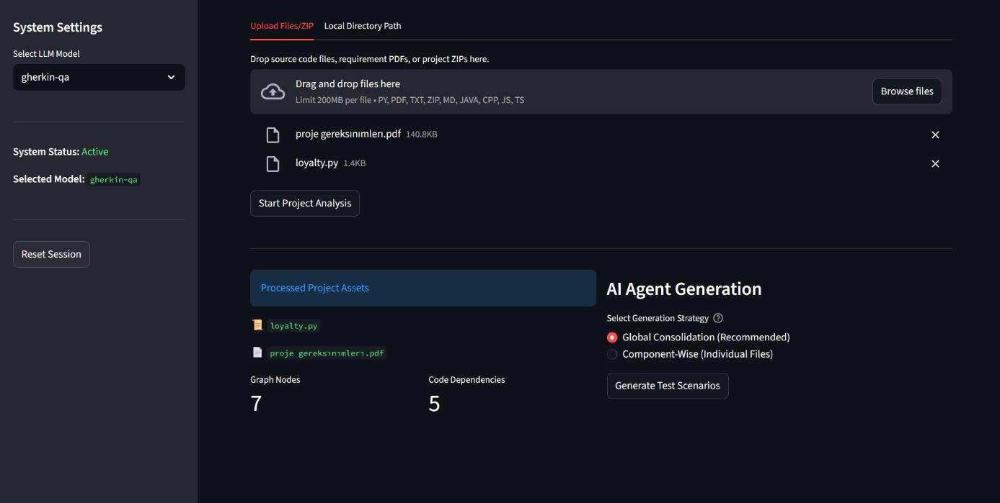
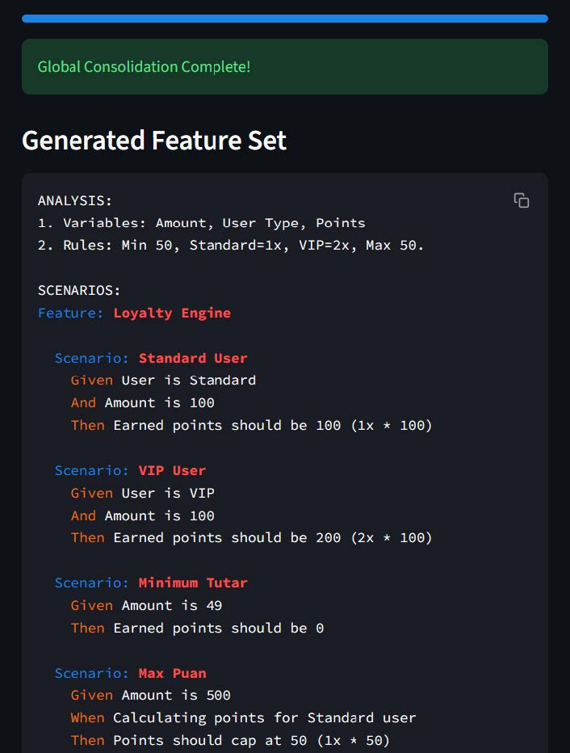
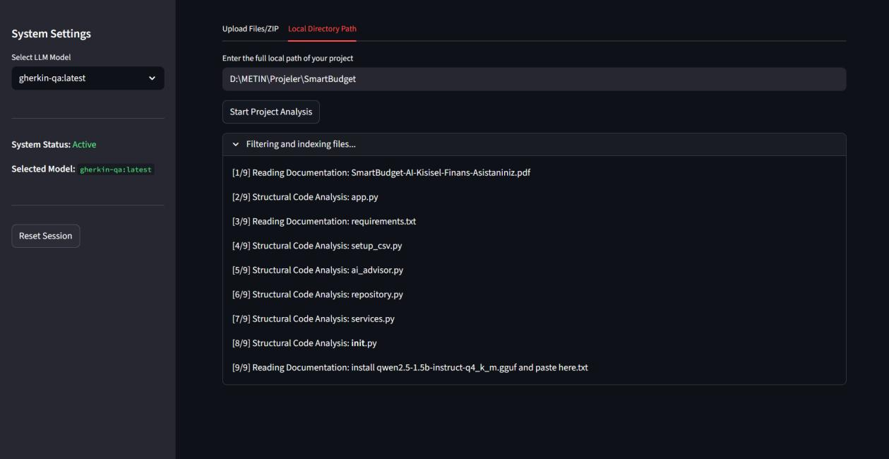
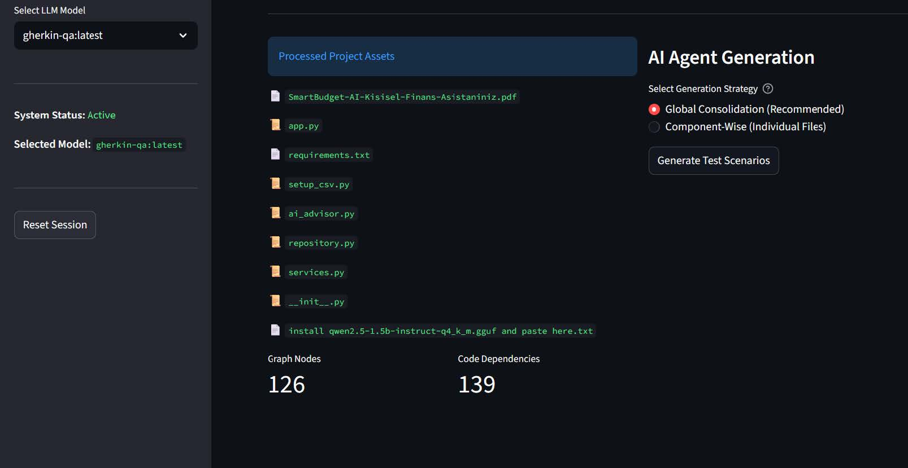
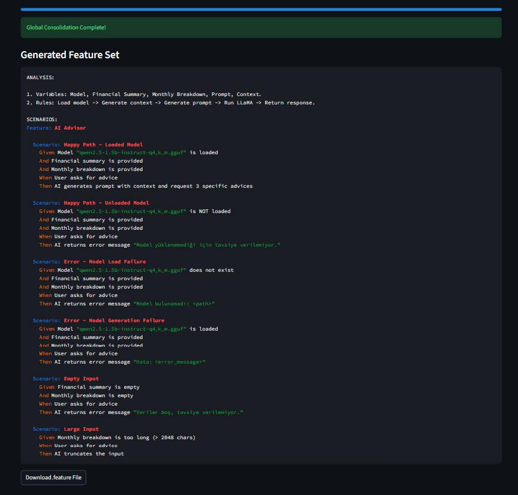
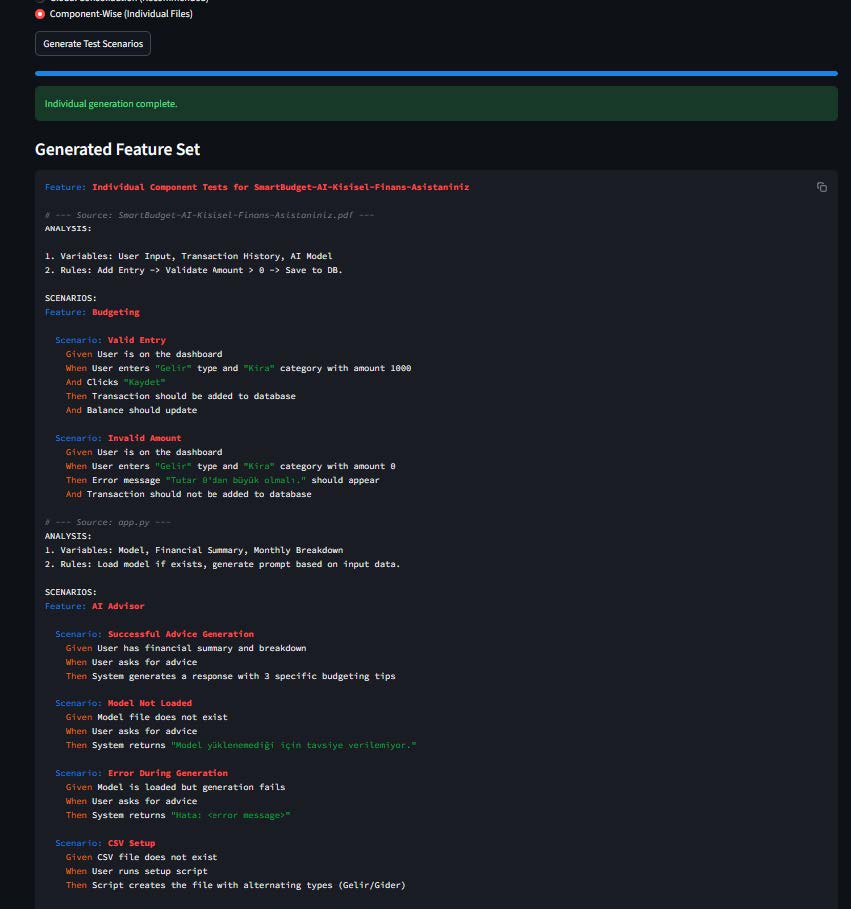

# 🧠 QA Expert AI: Neuro-Symbolic Test Engineering Agent

QA Expert AI is a production-ready testing solution that bridges the gap between **Natural Language Requirements (PDF)** and **Multi-Language Source Code**. Built on a Neuro-Symbolic RAG architecture, it builds a structural Knowledge Graph of your ecosystem and generates consolidated, high-fidelity **Gherkin Test Scenarios**.

## 🚀 Key Features

* **Global Logic Consolidation**: Automatically synthesizes scenarios from multiple files, eliminating overlaps while preserving critical business rules.
* **Neuro-Symbolic RAG**: Combines AST-based structural parsing with semantic vector search for deep context awareness.
* **Multi-Language Source Analysis**: Native support for Python, Java, JavaScript, C++, TypeScript, Go, and more.
* **Industrial Requirement Extraction**: Directly maps constraints and thresholds from technical PDFs to Gherkin scenarios.
* **Smart Filtering**: Automatically ignores `README.md`, media files, and build artifacts (`node_modules`, `venv`, etc.).
* **Flexible Data Ingestion**: Supports direct file uploads, ZIP archives, and Local Directory scanning.

## 🛠️ Tech Stack

* **UI Framework**: Streamlit
* **LLM Orchestration**: Ollama (Local LLM), LangChain
* **Vector Database**: ChromaDB (Dynamic Session-based)
* **Graph Engine**: NetworkX, Tree-Sitter
* **Document Analysis**: PyMuPDF (fitz)

## 📸 Screenshots

<p align="center">
  
  
  
</p>
<p align="center">
  
  
  
</p>
<p align="center">
  
  
  
</p>

## 📦 Installation

1.  **Clone & Navigate:**
    ```bash
    git clone [https://github.com/your-username/QA-Expert-AI.git](https://github.com/your-username/QA-Expert-AI.git)
    cd QA-Expert-AI
    ```

2.  **Install Dependencies:**
    ```bash
    pip install -r requirements.txt
    ```

3.  **Local LLM Setup:**
    Ensure [Ollama](https://ollama.ai/) is running. Pull the optimized model:
    ```bash
    ollama pull gherkin-qa
    ```

## 💻 Usage

1.  **Launch Dashboard:** `streamlit run app.py`
2.  **Input Method:** Use **Upload** for individual assets or **Local Path** to scan your entire repository.
3.  **Analyze**: Click **"Start Project Analysis"** to build the Knowledge Graph.
4.  **Consolidate**: Click **"Generate Master Test Suite"** to produce a single, de-duplicated Gherkin feature file.

## 📂 Project Structure

```text
.
├── app.py              # Main GUI and Orchestration logic
├── src/
│   ├── graph/          # AST Parsing (Symbolic Logic)
│   ├── rag/            # Vector Search (Neural Retrieval)
│   ├── agent/          # LLM QA Clients
│   └── utils/          # Document extraction utilities
├── data/
│   └── vector_db/      # Persistent Session storage
├── Modelfile           # Custom QA System Prompt
└── requirements.txt    # Library dependencies
```
Maintained by: [Metin Deder - Fırat University Computer Engineering Student]
